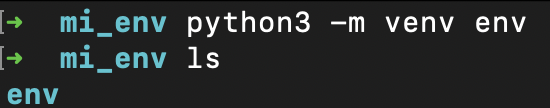
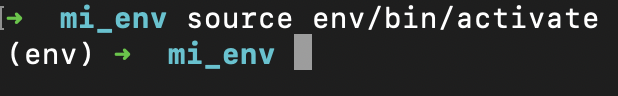
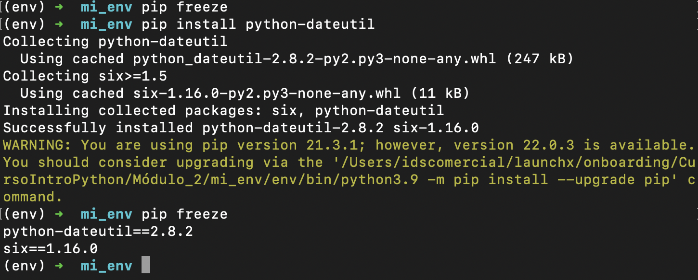
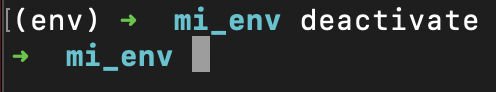

# Kata2: Crear un paquete

### Crear un entorno virtual

### Activar entorno virtual

### Instalar una biblioteca

***pip freeze***: comando para ver las bibliotecas instaladas en el entorno.

### Desactivar entorno virtual

Curso Propedútico de Python para Launch X - Innovacción Virtual.
